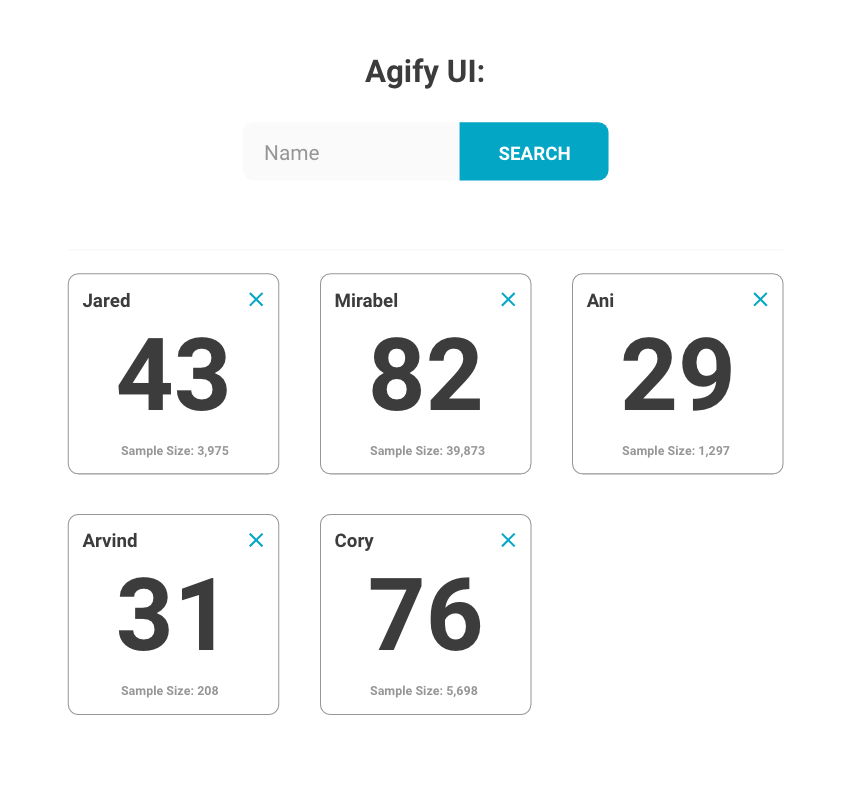

# Agify UI

Built a simple single-page application using the [Agify API](https://agify.io/). The user can input and submit any first name. The application will then display a card with the predicted age related to that name, as well as the sample size ("count" as it's referred to in the API). The user can also delete any card by clicking on the X in the card's upper right corner.

- Used HTML, CSS, and vanilla Javascript only.
- A maximum of 9 cards is shown at any given time. The earliest created card is removed as the count goes above 9.
- Upon refresh, the cards are persisted using local storage.
- Matched mockup.

Mockup:

  

    
  

